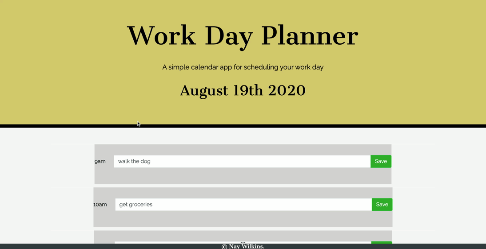

#  Work Day Planner

This is a simple calendar application that allows the user to save events for each hour of the day. This app runs in the browser and features dynamically updated HTML and CSS powered by jQuery. The tasks are stored into local storage, so if you refresh, your plans will still be there!

## deployed link : 

# Demo

## credits

© Nay Wilkins 2020

- - -
© 2019 Trilogy Education Services, a 2U, Inc. brand. All Rights Reserved.
